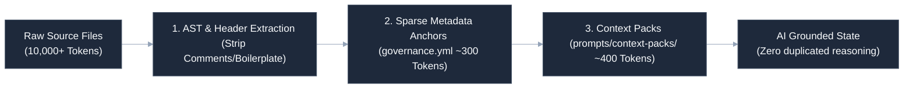

# Operational Context Compression & Token Optimization Strategy

In an ecosystem where human developers collaborate closely with AI coding models and autonomous agents, managing context budgets is critical. This document details our engineering strategies for minimizing token utilization, eradicating duplicated agent reasoning, and keeping editor operations fast and low-latency.

---

## ⚡ Core Optimization Methodologies

---

## 📂 1. Sparse Metadata Strategy

Traditional AI coding assistants waste massive token budgets scanning full repository structures just to answer basic questions about the environment.
* **Metadata Anchor**: By declaring the runtime language, framework, database, and telemetry sinks in a small, 40-line `governance.yml` file, we reduce initial environment scan costs by up to **90%**.
* **AI Parser Grounding**: Editor rules files (`.cursorrules`) immediately instruct the model to locate and read `governance.yml` first before executing any file scan commands, ensuring the agent remains grounded in ~300 tokens.

---

## 🧩 2. Prompt Modularization & Context Injection

Instead of maintaining a massive monolithic rules file that is sent on every chat invocation, we employ modular prompts:
* **Directory Isolation**: Prompt assets are isolated under the `/prompts` folder and grouped by domain (e.g. `prompts/context-packs/`).
* **Just-In-Time (JIT) Context Packs**: Rather than passing full application architecture guides, the editor loading script parses and injects only the relevant context pack (`fastapi.context.md` or `nextjs.context.md`) corresponding to the active working file.

---

## 📦 3. Asset Recycling & Deduplication

Duplicating architectural explanations across multiple files leads to token bloat and outdated documentation.
* **Shared Visual Libraries**: Complex system flows are mapped using standardized Mermaid `.mmd` assets under `/templates/mermaid/`. Instead of repeating long graph layouts inside every spec, markdown files refer directly to the central asset or embed the identical theme-aligned layout.
* **Cross-Repo Linkage**: Downstream repository READMEs link directly to the central standards canon repo instead of reproducing compliance matrices locally, preserving a clean portfolio hierarchy.

---

## 🔍 4. Sparse Telemetry Compression

Heavy telemetry architectures emit long, redundant string logs that are expensive to ingest and parse.
* **Envelope Compression**: We replace verbose unstructured log print loops with concise, structured JSON payloads.
* **Trace-Metric Correlation**: Metrics are linked to distributed traces via short trace context keys, allowing collectors to extract detailed span records without requiring long nested JSON arguments in logs.
