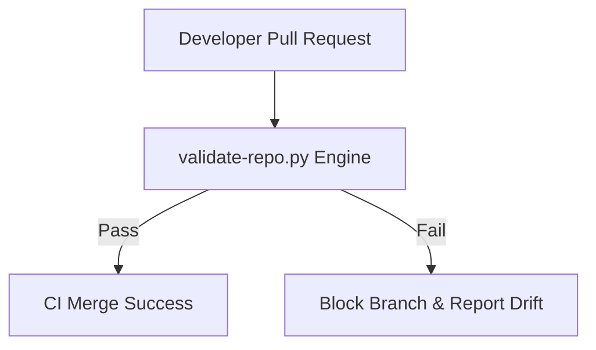

# Reusable Governance Architecture & Drift Prevention

This document defines the automated, schema-driven, and capabilities-oriented repository governance system. 

By defining **capabilities** instead of hardcoded package dependencies, we keep our verification framework lightweight and adaptable across language runtimes.

---

## 🎯 Capability-Oriented Governance

Unlike traditional enterprise governance which enforces exact package structures (e.g., forcing a specific npm logging version), we enforce **capability declarations** and **conformance validation**.

### Core Governance Capabilities
1. **Schema Validation**: The project's root must contain a fully conformant `governance.yml` matching our global standard metadata JSON schema.
2. **Markdown Lint Conformity**: Documentation files must follow structural, clean Markdown headers to preserve readability for both recruiters and AI parser models.
3. **Taxonomy Enforcement**: Common folder names (`src/`, `docs/`, `tests/`, `templates/`) must map to standard directories to facilitate instant developer/AI onboarding.

---

## 🛡️ Drift Prevention Strategies

To avoid architectural erosion as codebases evolve:

* **Local Verification**: Developers run `./validation/bin/validate-repo.py --target ./` as a pre-commit check.
* **CI Validation Gates**: GitHub Actions run the validator script on every pull request. If the developer expands properties without declaring them in `governance.yml`, the build fails.
* **AI Editor Boundaries**: Local rules files (.cursorrules) instruct code editor models to read `governance.yml` before proposing new classes or folders.
