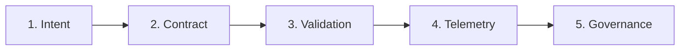

# SpecDD-Inspired Operational Contract Model

This specification defines the lightweight, non-bureaucratic, and context-efficient contract engine for our engineering operating model. 

Rather than enterprise orchestration gates, we use a deterministic data flow that establishes expectations and enforces them at the codebase level.

---

## 🔄 The Flow Model

### 1. Intent (Deciding What to Build)
* **Definition**: A developer or team identifies a feature, script, or service boundary.
* **Asset Location**: Simple `docs/architecture.md` outline or markdown checklist.
* **AI Leverage**: AI is grounded in the central prompt repository to draft initial parameters.

### 2. Contract (Declaring the Environment)
* **Definition**: A static declarative metadata block defining tech runtime, capability boundaries, and telemetry hooks.
* **Asset Location**: Root-level `governance.yml` mapping.
* **AI Leverage**: The AI reads `governance.yml` to understand the codebase context in ~300 tokens instead of scanning full codebases.

### 3. Validation (Deterministic Checks)
* **Definition**: Static validations that verify code structures, file paths, security checks, and schema conformances.
* **Asset Location**: Centralized `validate-repo.py` script running in pre-commit and CI workflows.
* **AI Leverage**: The editor LLM aligns code syntax directly with `validate-repo.py` outcomes.

### 4. Telemetry (Observability Verification)
* **Definition**: Measuring that the software's active state mirrors the contract definition.
* **Asset Location**: Common metric exports and standardized trace metrics mapping to standard sinks.
* **AI Leverage**: AI generates trace calls by referring to standard schemas instead of inventing novel logs.

### 5. Governance (Audit & Alignment)
* **Definition**: Continuous alignment of repository operations without heavy-handed meeting ceremonies.
* **Asset Location**: Self-auditing maturity taxonomy ratings (Bronze, Silver, Gold).
* **AI Leverage**: The AI flags architecture drift by cross-referencing telemetry hooks.
