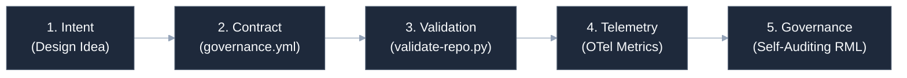
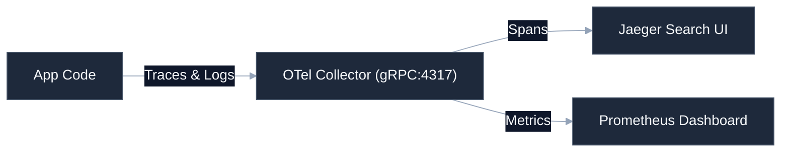

# Mermaid Architecture Visual Specifications

This document defines the standardized visual theme, layout structure, and reusable templates for Mermaid diagrams across our portfolio repositories. 

By applying these standards, we ensure that all architectural diagrams look premium, render perfectly in GitHub Dark/Light modes, and stay compact for AI token efficiency.

---

## 🎨 1. Theme Configuration

Mermaid supports direct JSON initialization blocks. All diagrams must include the following initialization header to apply our standard **Slate & Charcoal Palette**:

```markdown
%%{init: {'theme': 'base', 'themeVariables': { 'primaryColor': '#1e293b', 'primaryTextColor': '#f8fafc', 'primaryBorderColor': '#475569', 'lineColor': '#94a3b8', 'secondaryColor': '#0f172a', 'tertiaryColor': '#334155'}}}%%
```

### Visual Guidelines
* **Layout Orientation**: Prefer `graph LR` (Left-to-Right) instead of `graph TD` (Top-Down). LR layouts fit standard widescreen monitors better and wrap more elegantly in README formats.
* **Label Quotes**: Always wrap labels with spaces or symbols in quotes: `A["Node (CLI Tool)"]` to prevent parser failures.
* **Minimal Crossings**: Organize hierarchy flows logically to minimize intersecting edge crossings.

---

## 📋 2. Reusable Visual Templates

Below are copy-pasteable, theme-aligned blueprints ready to be deployed.

### Template A: Governance SpecDD Lifecycle Flow
Illustrates the intent and capabilities validation sequence:



```markdown
# Copy-pasteable Markdown Code:
%%{init: {'theme': 'base', 'themeVariables': { 'primaryColor': '#1e293b', 'primaryTextColor': '#f8fafc', 'primaryBorderColor': '#475569', 'lineColor': '#94a3b8', 'secondaryColor': '#0f172a', 'tertiaryColor': '#334155'}}}%%
graph LR
    Intent["1. Intent <br>(Design Idea)"] --> Contract["2. Contract <br>(governance.yml)"]
    Contract --> Validation["3. Validation <br>(validate-repo.py)"]
    Validation --> Telemetry["4. Telemetry <br>(OTel Metrics)"]
    Telemetry --> Governance["5. Governance <br>(Self-Auditing RML)"]
```

---

### Template B: Observability Telemetry Architecture
Maps application data ingestion to visualization endpoints:



```markdown
# Copy-pasteable Markdown Code:
%%{init: {'theme': 'base', 'themeVariables': { 'primaryColor': '#1e293b', 'primaryTextColor': '#f8fafc', 'primaryBorderColor': '#475569', 'lineColor': '#94a3b8', 'secondaryColor': '#0f172a', 'tertiaryColor': '#334155'}}}%%
graph LR
    App["App Code"] -->|Traces & Logs| Collector["OTel Collector (gRPC:4317)"]
    Collector -->|Spans| Jaeger["Jaeger Search UI"]
    Collector -->|Metrics| Prometheus["Prometheus Dashboard"]
```
