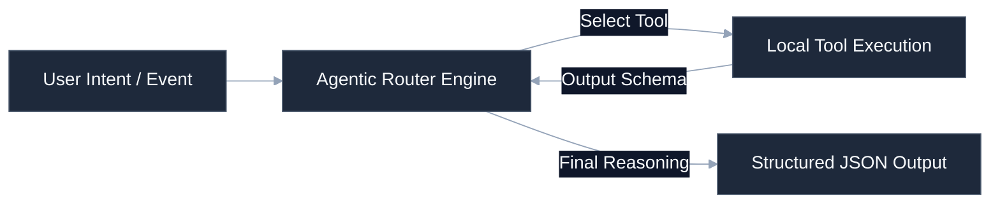

# [AI Orchestration System Name]

[](https://github.com/your-username/engineering-standards)
[]()
[]()
[](LICENSE)

Determined agentic routing, tool-use execution, and model optimization orchestration layer. Handles system prompt caching, stateful conversation persistence, recursive execution limits, and structured JSON output validation for multi-agent workflows.

---

## 🚀 Quick Start

### 1. Configure API Credentials
Copy the environment variables template and configure your keys:
```bash
cp .env.example .env
# Edit .env with your specific API credentials (OPENAI_API_KEY, ANTHROPIC_API_KEY, etc.)
```

### 2. Install Package Dependencies
```bash
pip install -r requirements.txt
```

### 3. Run Pipeline Daemon
```bash
python -m src.orchestrator --config config/agents.yml
```

---

## 🛠️ Operating Context (AI Ready)

To minimize context token consumption for AI agents and maintain a premium layout for developers, structural details are nested below.

<details>
<summary><b>🔍 System Layout & Code Boundaries</b></summary>

```
├── src/
│   ├── orchestrator.py        # Central runtime loop & state engine
│   ├── agents/                # Agent personas, prompt templates & tools
│   ├── tools/                 # Execution tool definitions (CLI, files, APIs)
│   ├── memory/                # Conversation state & vector storage
│   └── telemetry.py           # OTel logging and token cost metric trackers
├── prompts/
│   └── system_prompts.yml     # Immutable base prompts & routing guidelines
├── config/
│   └── agents.yml             # Capabilities and LLM routing assignments
└── tests/
    └── test_reasoning.py      # Regression checks for tool and routing loops
```
</details>

<details>
<summary><b>📊 LLM Agent Orchestration & Tool Loop</b></summary>

Standardized execution workflow mapping how the router handles prompt parsing and tool execution:


</details>

<details>
<summary><b>⚙️ AI Curation & Token Constraints</b></summary>

This system enforces strict parameters to minimize token budgets and avoid reasoning recursion loops:
* **Max Iterations Check**: Any agentic execution path is capped at 10 consecutive tool loops before self-terminating.
* **Token Caching Strategy**: Base system instructions are compiled using static system prompt blocks mapped to system caches.
* **Telemetry Reporting**: Every request records prompt tokens, completion tokens, latency overhead, and API billing estimates.
</details>

---

## ⚖️ Governance & Compliance

This repository conforms strictly to the portfolio engineering standards. All pull requests are checked for drift using the central verification suite:
```bash
python .standards-repo/validation/bin/validate-repo.py --target ./ --observability
```
