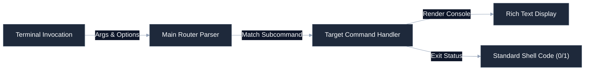

# [CLI Tool Name]

[](https://github.com/your-username/engineering-standards)
[]()
[]()
[](LICENSE)

Lightweight, deterministic command-line interface designed for systems engineering, automated scripting operations, and developer utilities. Focuses on speed, clean terminal formatting, and standard error handling patterns.

---

## 🚀 Quick Start

### 1. Install Global Binary
You can install directly using pip or run from source:
```bash
pip install --editable .
```

### 2. Basic Command Syntax
```bash
# Display core help menus
my-tool --help

# Execute target audit routines
my-tool audit --path /path/to/target --verbose
```

### 3. Check CLI Status
```bash
my-tool status
```

---

## 🛠️ Operating Context (AI Ready)

To minimize context token consumption for AI agents and maintain a premium layout for developers, structural details are nested below.

<details>
<summary><b>🔍 System Layout & Code Boundaries</b></summary>

```
├── src/
│   ├── main.py          # Entrypoint and central CLI router (Typer)
│   ├── commands/        # Sub-commands implementation (audit, sync, status)
│   ├── utils/           # Console styling and path helpers (Rich)
│   └── telemetry.py     # Simple standard logging wrappers
├── setup.py             # Packaging metadata
└── tests/               # Cli execution unit tests (CliRunner)
```
</details>

<details>
<summary><b>📊 Command Line Routing & Pipeline Flow</b></summary>

Standardized execution workflow mapping how the CLI parses terminal arguments and emits shell codes:


</details>

<details>
<summary><b>⚙️ CLI Behavior Rules & Exit Standards</b></summary>

This tool adheres strictly to POSIX-compliant scripting conventions:
* **Deterministic Return Codes**: Success returns code `0`. Errors or validation failures always return code `1` or higher.
* **Standard Streams**: Normal results stream directly to `stdout`. Technical error stacktraces or warning logs stream to `stderr`.
* **Zero Overhead Parsing**: Does not require heavy GUI runtimes, web server components, or database drivers.
</details>

---

## ⚖️ Governance & Compliance

This repository conforms strictly to the portfolio engineering standards. All pull requests are checked for drift using the central verification suite:
```bash
python .standards-repo/validation/bin/validate-repo.py --target ./ --audit
```
