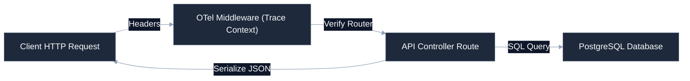

# [FastAPI Service Name]

[](https://github.com/your-username/engineering-standards)
[]()
[]()
[](LICENSE)

Async REST API backend service providing high-performance JSON endpoints, structured dependency injection, standard SQLAlchemy database migrations, and built-in telemetry instruments.

---

## 🚀 Quick Start

### 1. Install & Pin Python Dependencies
We recommend utilizing `uv` or `pip` to setup virtual environments:
```bash
python -m venv .venv
source .venv/bin/activate  # On Windows: .venv\Scripts\activate
pip install -r requirements.txt
```

### 2. Run Database Migrations
Ensure environment files are loaded before executing Alembic:
```bash
alembic upgrade head
```

### 3. Launch Development Server
```bash
uvicorn src.main:app --host 0.0.0.0 --port 8000 --reload
```
Interactive docs will be available at: `http://localhost:8000/docs`

---

## 🛠️ Operating Context (AI Ready)

To minimize context token consumption for AI agents and maintain a premium layout for developers, structural details are nested below.

<details>
<summary><b>🔍 System Layout & Code Boundaries</b></summary>

```
├── src/
│   ├── main.py               # Application entrypoint & middlewares
│   ├── api/                  # Routes and endpoint controllers
│   ├── core/                 # Config, security, and DB settings
│   ├── models/               # SQLAlchemy models (Pydantic / DB)
│   ├── services/             # Core business logic handlers
│   └── telemetry.py          # OTel middlewares and tracer initializations
├── migrations/               # Alembic database migrations
├── config/                   # Static configurations
└── tests/                    # Endpoint test suite
```
</details>

<details>
<summary><b>📊 FastAPI Request Pipeline & Telemetry</b></summary>

Standardized execution workflow mapping how the API handles route filtering and trace spans:


</details>

<details>
<summary><b>⚙️ Architecture Contracts & Telemetry</b></summary>

The service adheres strictly to async backend conventions:
* **Async IO Execution**: All database queries and external network tasks must utilize async/await structures.
* **OpenTelemetry Middleware**: Incoming requests automatically register spans. Middleware injects `trace_id` in response headers for trace tracking.
* **Error Envelope**: All error exceptions are wrapped in a standard JSON envelope: `{"detail": [{"loc": [], "msg": "", "type": ""}]}`.
</details>

---

## ⚖️ Governance & Compliance

This repository conforms strictly to the portfolio engineering standards. All pull requests are checked for drift using the central verification suite:
```bash
python .standards-repo/validation/bin/validate-repo.py --target ./ --observability
```
