# [Governance System Name]

[](https://github.com/your-username/engineering-standards)
[]()
[]()
[](LICENSE)

Central Single Source of Truth (SSOT) for engineering standards, compliance metadata schemas, editor configuration constraints, and automated verification suites across all portfolio repositories.

---

## 🚀 Quick Start

### 1. Validate Target Repository Metadata
```bash
python validation/bin/validate-repo.py --target /path/to/your/repo --schema governance/schemas/governance-schema.json
```

### 2. Run Comprehensive Compliance Audit
```bash
python validation/bin/validate-repo.py --target /path/to/your/repo --audit --observability
```

### 3. Install Pre-Commit Hooks
Add standard validator pipelines to your repository workflow:
```bash
cp hooks/pre-commit-standards.sh .git/hooks/pre-commit
chmod +x .git/hooks/pre-commit
```

---

## 🛠️ Operating Context (AI Ready)

To minimize context token consumption for AI agents and maintain a premium layout for developers, structural details are nested below.

<details>
<summary><b>🔍 System Layout & Code Boundaries</b></summary>

```
├── governance/
│   ├── schemas/              # JSON Schemas (governance-schema.json)
│   └── templates/            # Base templates (governance.yml, LICENSE)
├── specs/                    # Spec-Driven Development specs (SpecDD)
├── templates/
│   ├── readmes/              # Standardized README archetypes
│   └── mermaid/              # Standardized Mermaid MMD charts
└── validation/
    ├── bin/                  # Central python CLI validator scripts
    └── requirements.txt      # Validator dependencies (pyyaml, jsonschema)
```
</details>

<details>
<summary><b>📊 Centralized Governance & Drift Control</b></summary>

Standardized execution workflow mapping how the validator checks a target project structure and prevents architectural drift:

```mermaid
%%{init: {'theme': 'base', 'themeVariables': { 'primaryColor': '#1e293b', 'primaryTextColor': '#f8fafc', 'primaryBorderColor': '#475569', 'lineColor': '#94a3b8', 'secondaryColor': '#0f172a', 'tertiaryColor': '#334155'}}}%%
graph LR
    PR["Developer Commit / PR"] --> Validator["validate-repo.py CLI"]
    Validator -->|Parse| YAML["governance.yml Metadata"]
    YAML -->|Validate Schema| Valid["JSON Schema Check"]
    Valid -->|Scan Structure| Done["Merge Allowed"]
```


</details>

<details>
<summary><b>⚙️ Standards Rulesets & Requirements</b></summary>

All portfolio repositories must satisfy the following baseline standards:
* **Compliance file anchors**: Must possess a root-level `governance.yml` and `LICENSE`.
* **Editor rulesets**: Must possess `.cursorrules` in their root directory to enforce model constraints.
* **Maturity level check**: Must declare a recognized maturity level (`experimental`, `operational`, `production`, etc.) corresponding directly with validation rigor.
</details>

---

## ⚖️ Governance & Compliance

This repository conforms strictly to the portfolio engineering standards. All pull requests are checked for drift using the central verification suite:
```bash
python validation/bin/validate-repo.py --target ./ --observability
```
