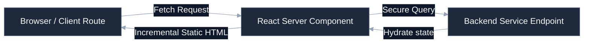

# [Next.js SaaS Web App Name]

[](https://github.com/your-username/engineering-standards)
[]()
[]()
[](LICENSE)

Premium, fast-rendering web application leveraging Next.js App Router, React Server Components (RSC), Tailwind CSS variables, and modular frontend components for seamless operational dashboards.

---

## 🚀 Quick Start

### 1. Install Node Dependencies
Ensure you are using the designated Node engine via `fnm` or `nvm`:
```bash
npm install
```

### 2. Configure Environment Variables
```bash
cp .env.local.example .env.local
# Customize environment endpoints (API servers, Auth provider tokens)
```

### 3. Launch Development Server
```bash
npm run dev
```
Open your browser and navigate to: `http://localhost:3000`

---

## 🛠️ Operating Context (AI Ready)

To minimize context token consumption for AI agents and maintain a premium layout for developers, structural details are nested below.

<details>
<summary><b>🔍 System Layout & Code Boundaries</b></summary>

```
├── app/                      # Next.js App Router root
│   ├── layout.tsx            # Global wrappers (Providers, Fonts, Theme)
│   ├── page.tsx              # Landing homepage
│   ├── api/                  # Edge server API endpoints
│   └── (dashboard)/          # Authenticated dashboard views
├── components/               # Reusable modular UI components
│   ├── ui/                   # Primitive design tokens (Buttons, Modals)
│   └── dashboard/            # High-level charts and tables
├── hooks/                    # Custom React hook utilities
├── styles/                   # Global CSS imports (Tailwind layers)
└── public/                   # Static optimization assets (icons, images)
```
</details>

<details>
<summary><b>📊 Client-Server Ingestion & Rendering</b></summary>

Standardized visual flow mapping rendering pathways between client components and backend resources:


</details>

<details>
<summary><b>⚙️ Design System & Component Guidelines</b></summary>

This repository maintains zero design layout drift:
* **Tailwind Consistency**: All styles must rely on the central `tailwind.config.js` theme variables. Never inject ad-hoc pixel values; use standard tailwind padding and margin scale parameters.
* **State Boundaries**: Keep client logic (such as interactive modals, form inputs, button toggles) contained to leaf nodes by prefixing them with `'use client'`. Keep data fetchers server-side.
* **TypeScript Rigor**: All interfaces must be explicitly typed; avoid bypass tricks such as `any`.
</details>

---

## ⚖️ Governance & Compliance

This repository conforms strictly to the portfolio engineering standards. All pull requests are checked for drift using the central verification suite:
```bash
python .standards-repo/validation/bin/validate-repo.py --target ./ --audit
```
