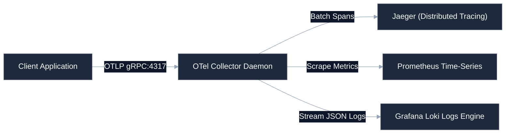

# [Observability Platform Name]

[](https://github.com/your-username/engineering-standards)
[]()
[]()
[](LICENSE)

High-performance telemetry aggregation, processing, and visualization platform. Acts as the central pipeline for logs, metrics, and trace spans emitted from downstream systems, offering deterministic routing, structured querying, and dashboard integrations.

---

## 🚀 Quick Start

### 1. Launch Collector Daemon
```bash
docker-compose -f deploy/docker-compose.yml up -d
```

### 2. Verify Ingestion Ports
Ensure standard OTLP ports are open on `localhost`:
- `4317` (gRPC Telemetry Ingestion)
- `4318` (HTTP Telemetry Ingestion)
- `9090` (Prometheus Metrics Scraper)

### 3. Local Verification Run
```bash
# Push test span to local receiver
python validation/push_test_span.py --endpoint http://localhost:4318/v1/traces
```

---

## 🛠️ Operating Context (AI Ready)

To minimize context token consumption for AI agents and maintain a premium layout for developers, structural details are nested below.

<details>
<summary><b>🔍 System Layout & Code Boundaries</b></summary>

```
├── cmd/
│   └── collector/            # Collector entrypoint (Go)
├── src/
│   ├── filters/              # Log parsing & filter pipelines
│   ├── sinks/                # Exporters (Loki, Jaeger, Prometheus)
│   └── telemetry.py          # Internal self-monitoring hooks
├── config/
│   ├── otel-collector.yml    # Central routing config
│   └── prometheus.yml        # Metrics scraping intervals
└── tests/                    # Ingestion contract checks
```
</details>

<details>
<summary><b>📊 Ingestion & Routing Pipelines</b></summary>

Standardized flow mapping how trace spans and metric events propagate to their respective sinks:


</details>

<details>
<summary><b>⚙️ Telemetry Contract Requirements</b></summary>

Downstream repositories targeting this platform must guarantee:
* **Log Structure**: Serialized single-line JSON with standard fields (`timestamp`, `level`, `service`, `message`).
* **Trace Context Propagation**: HTTP headers must inject standard W3C Trace Context (`traceparent`).
* **Core Metrics Standard**:
  * `<service_name>_requests_total` (Counter)
  * `<service_name>_request_duration_seconds` (Histogram)
  * `<service_name>_errors_total` (Counter)
</details>

---

## ⚖️ Governance & Compliance

This repository conforms strictly to the portfolio engineering standards. All pull requests are checked for drift using the central verification suite:
```bash
python .standards-repo/validation/bin/validate-repo.py --target ./ --observability
```
