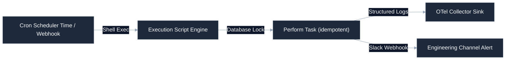

# [Operational Automation Platform Name]

[](https://github.com/your-username/engineering-standards)
[]()
[]()
[](LICENSE)

Robust, low-latency execution system governing portfolio cron jobs, database backups, environment deployments, and telemetry verification pipelines. Focuses on crash resilience, idempotent operations, and deterministic retry mechanisms.

---

## 🚀 Quick Start

### 1. Set Execution Permissions
Ensure scripts are executable on your hosting systems:
```bash
chmod +x bin/*.sh
```

### 2. Configure Crontab Tasks
To install the standardized cron jobs to the host machine:
```bash
crontab config/crontab.txt
```

### 3. Run Pipeline Check
Manually test the full automation loop:
```bash
python scripts/run_backup_cycle.py --dry-run
```

---

## 🛠️ Operating Context (AI Ready)

To minimize context token consumption for AI agents and maintain a premium layout for developers, structural details are nested below.

<details>
<summary><b>🔍 System Layout & Code Boundaries</b></summary>

```
├── bin/
│   ├── run-pipeline.sh       # Root bash shell trigger
│   └── cleanup-logs.sh       # Log rotating script
├── scripts/
│   ├── run_backup_cycle.py   # Secure data archiving & backup logic
│   ├── notify_slack.py       # Notification dispatcher webhook
│   └── telemetry_audit.py    # Verify system state reports
├── config/
│   ├── crontab.txt           # Standard scheduler configurations
│   └── jobs.json             # Execution lists and parameters
└── tests/
    └── test_idempotency.py   # Verify loops do not duplicate records
```
</details>

<details>
<summary><b>📊 Automation Trigger & Notification Flow</b></summary>

Standardized execution workflow mapping how the scheduler fires automation scripts and reports telemetry:


</details>

<details>
<summary><b>⚙️ Reliability Rules & Failure Standards</b></summary>

All automation scripts within this repository must adhere to the following rules:
* **Strict Idempotency**: Scripts must be safely runnable multiple times concurrently without corrupting files or creating duplicate database transactions.
* **Timeout Limits**: Every network action (e.g. database push, slack webhook post) must specify a maximum timeout.
* **Fail-Soft Mode**: Minor non-blocking failures must trigger warning events without causing the entire cron pipeline to exit with a non-zero crash code.
</details>

---

## ⚖️ Governance & Compliance

This repository conforms strictly to the portfolio engineering standards. All pull requests are checked for drift using the central verification suite:
```bash
python .standards-repo/validation/bin/validate-repo.py --target ./ --observability
```
